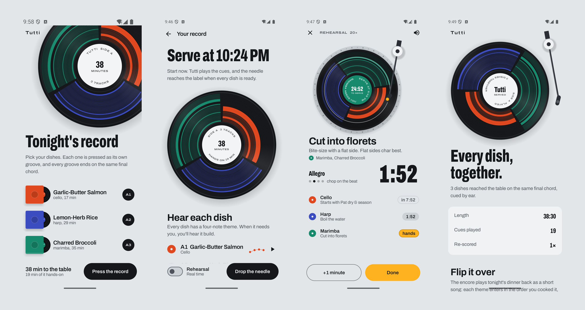

# Tutti

**Cook in concert.** Tutti turns dinner into a piece of music. Every dish gets its own instrument and leitmotif, and the music tells you when to act, so everything reaches the table on the same final chord.

> *tutti* (Italian, "all together"): the moment in a score when the whole orchestra plays at once.

**TXST Shipaton 2026 · Food × Music** · Native Android · Kotlin + Jetpack Compose · Real-time synthesis engine written from scratch



🎬 **Demo video (with the app's own audio):** [`docs/demo/tutti-demo.mp4`](docs/demo/tutti-demo.mp4)
🎼 **Presentation kit:** 12 slides as 1920×1080 PNGs in [`docs/deck/slides/`](docs/deck/slides) (source: [`docs/deck/deck.html`](docs/deck/deck.html)), plus slide copy and a demo script in [`docs/PITCH.md`](docs/PITCH.md)

---

## The problem

Cooking one dish is following a recipe. Cooking three at once is conducting an orchestra. The salmon needs flipping *now*, the rice has to rest, the broccoli is charring, and every one of them is on its own timer. People who struggle with time (novice cooks, anyone with ADHD time blindness, anyone with dough on their hands) end up with cold sides and burnt mains. Kitchen timers beep, but they don't tell you which dish, what to do, or how long you have left.

## The collision

Tutti works because food and music depend on each other in both directions.

| Food → Music | Music → Food |
|---|---|
| The recipes *compile* into a score: every step becomes a musical section, every dish a stave. | The music *conducts* the cook: a new instrument entering means a dish needs you. |
| The action sets the tempo: chopping is *Allegro* (104 bpm), whisking *Presto* (126), simmering *Adagio*. | You chop, stir and baste on the beat. The pace of the music is the pace of the work. |
| Heat you don't have to watch (simmer, roast) becomes a quiet drone, so you can hear that it's cooking. | A dish's leitmotif builds for a few bars before it needs you. You feel the moment coming without looking at a screen. |
| Tell Tutti you're running late (+1 minute) and the scheduler rewrites the rest of the score live. | The final chord lands when everything is ready. When you hear *tutti*, you serve. |

Timers beep; Tutti *sings*. Hearing that the harp has come in is faster, calmer and more hands-free than reading three countdowns.

## How it works

1. **Pick from the crate.** Choose your dishes. Each one gets its own instrument (salmon for cello, rice for harp, broccoli for marimba, salad for flute, mug cake for celesta), and the record at the top of the screen re-presses as you choose.
2. **Score.** Tutti's scheduler works *backwards* from the final chord. It keeps a single lane for your hands (you never get two hands-on tasks at once, and it leaves a 30-second breather between them whenever it can) and places passive heat as late as possible. It also respects each recipe's tolerances: how long ingredients can wait between steps, and how early a dish can finish and still be served at its best. The plan is drawn as a record: each dish owns a slice of the disc, time runs from the rim to the label, solid bands are your hands, and fine colored grooves are the heat. Tap a dish to hear its leitmotif before you start.
3. **Drop the needle.** A four-beat count-in lowers the tonearm onto the record. From then on it tracks inward in real time, the platter's strobe dots pulse on the beat, and an amber cue light means your hands are needed now. A live, generative arrangement in D major follows exactly what every dish is doing:
   - **Hands-on steps** play a rhythmic ostinato on the dish's instrument, shaped by the action (staccato for chopping, flowing arpeggios for stirring, syncopation and sizzle for searing) over a kick you can work to.
   - **Passive steps** play quiet textures: bubbling for boiling, long sustained notes for roasting, a soft recurring note for resting.
   - **Before a cue** the dish's leitmotif enters and grows louder as the moment gets closer, and the harmony tightens onto the dominant.
   - **On the cue** a bell rings, the leitmotif plays out, and the phone buzzes. The screen shows the instruction in large type, with the tempo marking and beat dots.
4. **Re-score live.** Finished early? Tap *Done*. Need more time? Tap *+1 minute*. Anything already on the heat stays fixed. Everything not yet begun is re-planned from that moment, and Tutti tells you whether the final chord holds or moves.
5. **Finale and encore.** When the last dish is ready, the whole orchestra plays the final chord together. The encore plays your dinner back as a short piece, with each leitmotif entering in the order you cooked it.

**Rehearsal mode** runs a performance at 20× speed, so you can see and hear the whole dinner in about two minutes.

## Engineering

- **Scheduler** (`schedule/Conductor.kt`): backward placement over a single hands-on resource. Tasks with the tightest windows go first (earliest-deadline-first, run in reverse), with one step of lookahead so no dish takes a slot another dish can't live without. A hill-climb then uses each dish's hold tolerance to remove any waiting, and drops the 30-second breather only if that's the last way to keep food from sitting. The same solver re-plans mid-performance, taking steps already started as fixed and "no earlier than now" as a hard floor. Unit tests cover all 31 possible menus: no overlapping hands-on tasks, every allowed gap and hold time respected, and live re-scoring stays valid.
- **Synthesizer** (`audio/Synth.kt`): a 48-voice polyphonic synth written from scratch, rendering float PCM sample by sample. It has twelve patches: filtered-saw cello, plucked harp, marimba with an inharmonic partial, breathy flute, celesta, FM bell, a detuned pad, bass, kick, hat and shaker. Voices are stored as preallocated primitive arrays, so rendering allocates nothing. A trimmed Freeverb adds the room.
- **Orchestra** (`audio/Orchestra.kt`): a sample-accurate 16th-note sequencer on a dedicated `URGENT_AUDIO` thread feeding `AudioTrack`. Tempo changes land on bar lines. The UI thread only publishes what each dish is doing; every musical decision is made on the audio thread. It can also record the performance to WAV.
- **UI** (`ui/`): Jetpack Compose with Material 3 controls, themed as a modern turntable: an aluminum plinth (smoked graphite in dark theme), black vinyl, dish colors printed only on labels and grooves, and one amber cue light. One variable typeface, Archivo, is used at three widths: condensed numerals, normal text, and expanded label caps. The record, tonearm, and label lettering are drawn on Canvas (`ui/Record.kt`) and driven by the audio engine's beat clock. It follows the system dark theme, honors Remove animations, and supports TalkBack.

```
app/src/main/java/app/tutti/
├── model/Recipes.kt        dishes, steps, instruments, tempo markings
├── schedule/Conductor.kt   backward scheduler + live re-scoring
├── audio/Synth.kt          polyphonic synthesizer + reverb
├── audio/Orchestra.kt      sequencer, arrangement rules, AudioTrack thread
├── session/Performance.kt  app state, session clock, cues, haptics
└── ui/                     theme, the turntable (Record.kt), and the four screens
```

## Build and run

Requirements: JDK 17 and the Android SDK (compileSdk 35).

```bash
./gradlew :app:installDebug        # build and install on a device or emulator
./gradlew :app:testDebugUnitTest   # scheduler tests across every menu combination
```

Or open the folder in Android Studio and run the `app` configuration. Tutti works on Android 8.0+ (API 26). Put your phone somewhere you can hear it, or use a Bluetooth speaker in the kitchen.

## Credits

Built in one day at TXST Shipaton. Font: [Archivo](https://fonts.google.com/specimen/Archivo) (SIL Open Font License). Icons: Material Symbols path data (Apache 2.0). All music is synthesized live on the device; the app ships no audio files.
